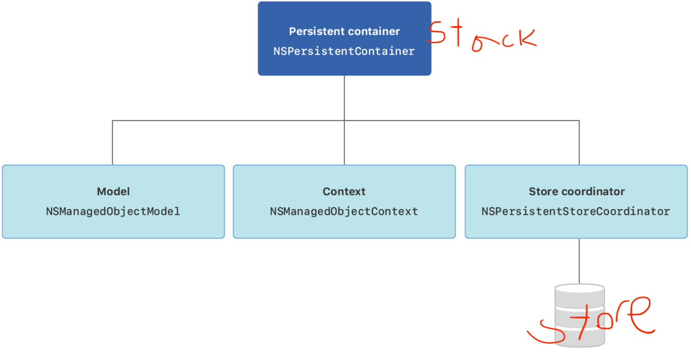

# DataCore (DB)

* [class] [NSManagedObject](https://developer.apple.com/documentation/coredata/nsmanagedobject) 

* [class] NSPersistentContainer(name: "DataCoreName") : Core Data **Stack**

  * Model : property, relation 정의
  * [NSManagedObjectContext](https://developer.apple.com/documentation/coredata/nsmanagedobjectcontext) : data 변화를 감지
    * methods
      * .fetch(NSFetchRequest) : request 조건에 부합하는 object를 Store에서 찾아 *array*로 반환
      * .save() : registered object의 변화를 (parent) Store에 저장 
      * .delete(entity) : 해당 entity를 Store에서 삭제
  * Coordinator : save and fetch data from stores (DB)

  

  * methods
    * .loadPersistentStores { } : container를 initialize한 후 **store에서 데이터를 로드**해야함. 데이터를 로드 한 후 closure에 에러 메시지를 출력함. 데이터 로드 후 stack은 바로 사용 가능.
  * property 
    * viewContext : main queue(?)의 `NSManagedObjectContext` 

* [class] [NSFetchRequest(entityName: "EntityName")](https://developer.apple.com/documentation/coredata/nsfetchrequest): 로드할 data(entity)의 조건(=predicates)을 명시.

  * [class] NSSortDescriptor(keyPath: \Entity.property, ascending: true): 데이터 정렬

    ```swift
    let sort = NSSortDescriptor(keyPath: \Entity.property, ascending: true)
    request.sortDescriptors = [sort]
    ```

  * [class] NSPredicate(format: "name == %@", "Apple"): 데이터 필터링

    ```swift
    let filter = NSPredicate(format: "name == %@", "Apple")
    request.predictate = filter
    ```


* delete 

  nullify : if Entity deleted, relationship stays just lossing Entity

  cascade : if Entity deleted, relationship also deleted

  deny : if relationship exists, Entity not deleted

- [core data attribute type](https://developer.apple.com/documentation/coredata/handling_different_data_types_in_core_data)
  - transformable : 새로운 타입
  - transient : computed property
  - derieved